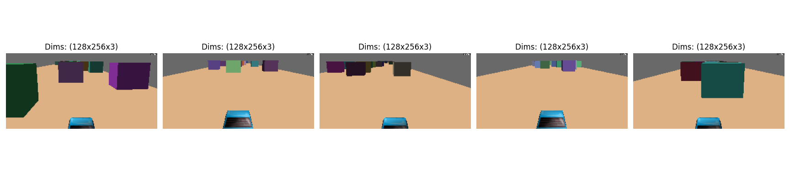
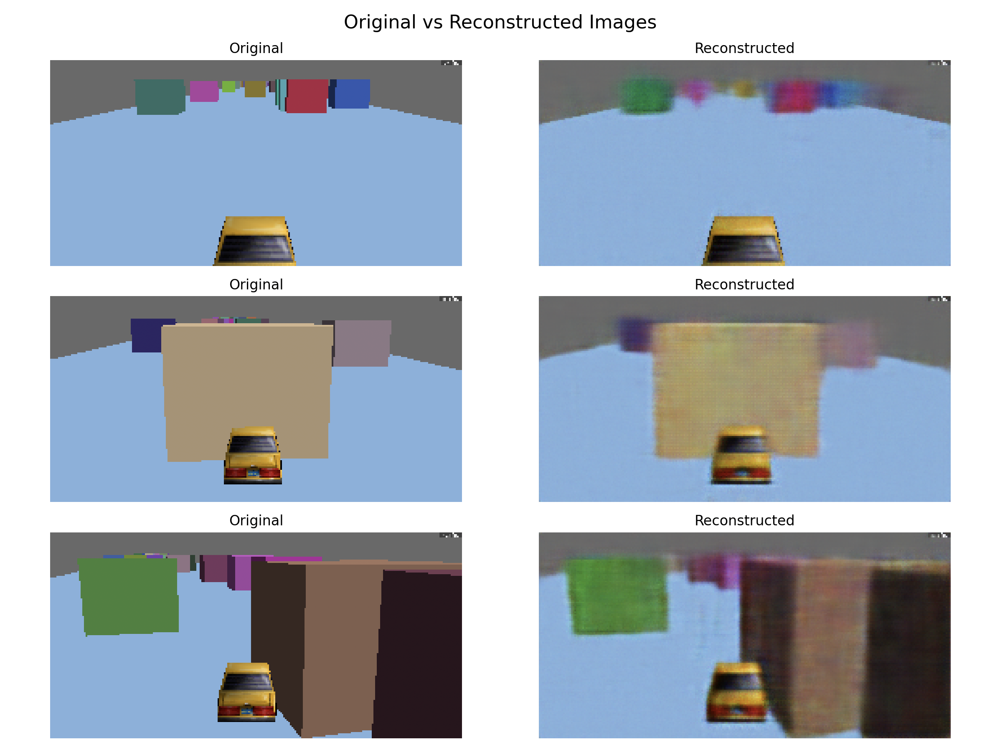

# 3D Car Game

A 3D driving game where you control a car in an open world environment while avoiding obstacles. If you crash into an obstacle, your car explodes!

## Reinforcement Learning Components

### Environment
The `RacingEnvironment` class in `src/game/racing_env.py` defines the game world where the agent operates. It:
- Manages the game state and physics
- Defines the action space (acceleration and turning controls)
- Provides state observations (car position, speed, heading, etc.)
- Calculates rewards based on:
  - Progress towards finish line
  - Staying on track
  - Avoiding collisions
  - Maintaining good speed
  - Reaching the finish line

### Agent
The agent is the entity that learns to control the car. In this project:
- The agent interacts with the environment through actions
- Actions are tuples of (acceleration, turning) values
- The agent receives state observations and rewards from the environment
- The agent's goal is to maximize cumulative rewards by learning optimal driving strategies

### Game State
The state representation includes:
- Car position (x, y coordinates)
- Car speed
- Car heading
- Distance to finish line
- Track boundary information
- All values are normalized to [-1, 1] range for better learning

### Actions
The action space consists of:
- Acceleration: [-1, 0, 1] (brake, nothing, accelerate)
- Turning: [-1, 0, 1] (left, straight, right)

### Rewards
The reward function provides:
- Positive rewards for:
  - Making progress towards finish line
  - Maintaining good speed
  - Reaching the finish line (+1000)
- Negative rewards for:
  - Going off track (-100)
  - Colliding with obstacles (-100)
  - Time penalty (-0.01 per step)

### Episode
An episode represents one complete run of the game, which ends when:
- The car reaches the finish line
- The car goes off track
- The car collides with an obstacle

### Timestep
Each timestep represents one frame of the game where:
- The agent selects an action
- The environment updates the game state
- The agent receives a new state observation and reward

## Requirements

- Python 3.7 or higher
- Panda3D game engine
- NumPy
- PyTorch (for VAE training)

## Installation

1. Create a virtual environment (recommended):
```bash
python -m venv venv
source .venv/bin/activate  # On Windows, use: venv\Scripts\activate
```

2. Install the required packages:
```bash
pip install -r requirements.txt
```

3. Add src to the pyhtonpath
```bash
export PYTHONPATH=$PYTHONPATH:./src
```

## Somme useful commands.

To start the game, run:
```bash
python src/game/car_game.py
```

Run N simulations for collecting samples (screenshots) of the game:
```bash
python src/data_collectors/vae_data_collector.py --samples 200 --instances 10
```

Visualize some of the images taken during data collector:
```bash
python src/utils/visualize_data.py --num_images 5
```

Train the VAE using the generated images:
```bash
python src/models/train_vae.py --epochs 20 --batch_size 2048
```

In case you want to continue training from a checkpoint:
```bash
python src/models/train_vae.py --epochs 60 --batch_size 2048 --from-checkpoint models/vae/vae_final.pt
```

Display geneared images by sampling the latent space:
```bash
python3 src/utils/sample_latent_space.py --num_samples=5 --latent_dim=128 --model_path=models/vae/vae_final.pt
```

Compare original images with VAE generated:
```bash
python src/utils/visualize_reconstruction.py
```

Run N simulations to collect data for the RNN-MDN model.
```bash
python src/data_collectors/mdn_rnn_data_collector.py --output_dir data_mdn_rnn --samples 1000 --instances 300 --parallelism 10  --vae-model-path models/vae/vae_final.pt  --latent-dim 128
```

Train the MDN-RNN model.
```bash
python src/models/train_mdn_rnn.py --data_dir data_mdn_rnn --output_dir models/mdn_rnn --epochs 60 --batch_size 2048 --input_size 131 --hidden_state_size 256 --num_mixtures 5 --z_dim 128
```

Some images:




*Example of the game environment with obstacles and the car in action.*

## Controls

- Arrow Up: Accelerate
- Arrow Down: Reverse
- Arrow Left: Turn Left
- Arrow Right: Turn Right
- ESC: Exit game

## Game Features

- 3D open world environment
- Realistic car physics with acceleration and friction
- Multiple obstacles to avoid
- Collision detection
- Third-person camera view
- Explosion effect on collision

## Note

You'll need to provide your own 3D models for:
- The car (`models/car`)
- The environment (`models/environment`)
- The obstacles (`models/box`)

You can find free 3D models on websites like:
- [Kenney Assets](https://kenney.nl/assets)
- [OpenGameArt](https://opengameart.org/)
- [Free3D](https://free3d.com/) 